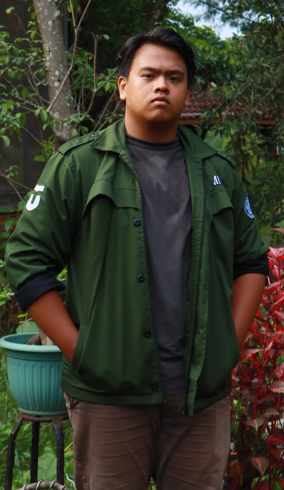

<html></html>
 <head>
  <title>
   Profil Pribadi
  </title>
  
 </head>
 <body>
  <h1>
   Profil Pribadi
  </h1>
  

   

    
    

     Foto Profil
    

   

   

    <iframe allowfullscreen="" frameborder="0" src="pop.mp4">
    </iframe>
    

     Video Perkenalan
    

   

  

  

   <h2>
    Tentang Saya
   </h2>
   

    Halo! Saya adalah seorang pengembang web antusias dengan passion di bidang teknologi dan desain kreatif.
   

  

  

   <h2>
    Keterampilan
   </h2>
   <table class="skills-table">
    <tr>
     <th>
      Keterampilan
     </th>
     <th>
      Tingkat
     </th>
    </tr>
    <tr>
     <td>
      HTML/CSS
     </td>
     <td>
      Mahir
     </td>
    </tr>
    <tr>
     <td>
      JavaScript
     </td>
     <td>
      Menengah
     </td>
    </tr>
    <tr>
     <td>
      Python
     </td>
     <td>
      Pemula
     </td>
    </tr>
   </table>
  

  

   <h2>
    Hubungi Saya
   </h2>
   <form class="contact-form">
    <input name="name" placeholder="Nama" type="text"/>
    <input name="email" placeholder="Email" type="email"/>
    <textarea name="message" placeholder="Pesan"></textarea>
    <button type="submit">
     Kirim Pesan
    </button>
   </form>
  

  

   <h2>
    Media Sosial:
   </h2>
   

    <a href="#">
     LinkedIn
    </a>
    |
    <a href="#">
     GitHub
    </a>
    |
    <a href="#">
     Twitter
    </a>
   

  

  

   

    Semoga Selalu diberi kemudahan^^
   

  

 </body>
</html>
